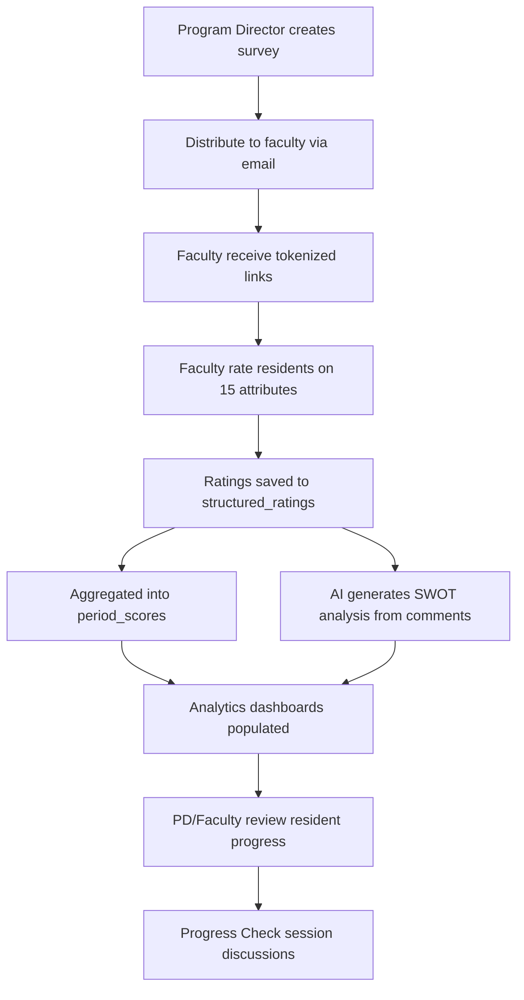
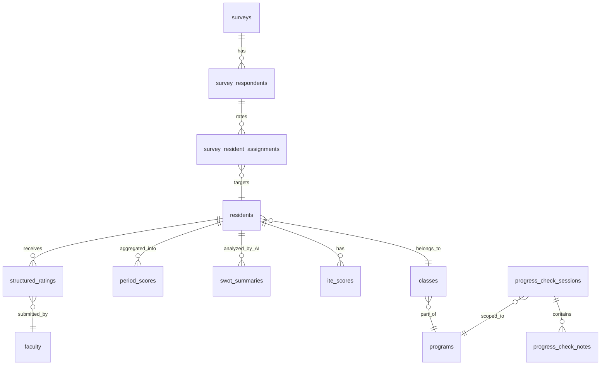

# PRD: Progress Check

> Resident evaluation and analytics tool built on the EQ·PQ·IQ framework.
> Runs at `eqpqiq.com/progress-check`.

---

## Overview

Progress Check is a data-driven resident evaluation tool for medical residency programs. It replaces the traditional Clinical Competency Committee (CCC) workflow with structured, longitudinal analytics using the **EQ·PQ·IQ framework** — 15 attributes across Emotional, Professional, and Intellectual Quotients.

The tool enables program directors and faculty to:

- Distribute and collect structured faculty and self-assessment surveys
- Visualize individual resident performance via radar charts, trend lines, and gap analysis
- Compare Core Faculty vs Teaching Faculty vs Self-Assessment perspectives
- Track development across PGY levels and academic periods
- Generate AI-powered SWOT analysis from qualitative evaluation comments
- Export raw evaluation data for reporting and accreditation

---

## EQ·PQ·IQ Framework

Residents are evaluated across **15 attributes** grouped into three quotients. Each attribute is scored **0–100**.

### EQ (Emotional Quotient)

| Attribute | Column | Description |
|-----------|--------|-------------|
| Empathy & Positive Interactions | `eq_empathy_positive_interactions` | Patient/family rapport, compassionate care |
| Adaptability & Self-Awareness | `eq_adaptability_self_awareness` | Flexibility, insight into strengths/weaknesses |
| Stress Management & Resilience | `eq_stress_management_resilience` | Performance under pressure, emotional regulation |
| Curiosity & Growth Mindset | `eq_curiosity_growth_mindset` | Learning drive, seeking improvement |
| Communication Effectiveness | `eq_effectiveness_communication` | Team communication, handoffs, presentations |

### PQ (Professional Quotient)

| Attribute | Column | Description |
|-----------|--------|-------------|
| Work Ethic & Reliability | `pq_work_ethic_reliability` | Dedication, punctuality, follow-through |
| Integrity & Accountability | `pq_integrity_accountability` | Ethics, honesty, ownership of mistakes |
| Teachability & Receptiveness | `pq_teachability_receptiveness` | Accepting feedback, implementing suggestions |
| Documentation | `pq_documentation` | Charting quality, completeness, timeliness |
| Leadership & Relationships | `pq_leadership_relationships` | Team dynamics, leadership potential |

### IQ (Intellectual Quotient)

| Attribute | Column | Description |
|-----------|--------|-------------|
| Knowledge Base | `iq_knowledge_base` | Medical knowledge breadth and depth |
| Analytical Thinking | `iq_analytical_thinking` | Clinical reasoning, differential diagnosis |
| Commitment to Learning | `iq_commitment_learning` | Acquiring new information, staying current |
| Clinical Flexibility | `iq_clinical_flexibility` | Adjusting approach based on new information |
| Performance for Level | `iq_performance_for_level` | Overall clinical performance relative to peers |

### Score Tiers

| Range | Label | Color |
|-------|-------|-------|
| 0–20 | Significant Concern | Red |
| 21–40 | Below Expectations | Orange |
| 41–60 | Meets Expectations | Blue |
| 61–80 | Exceeds Expectations | Green |
| 81–100 | Exceptional | Dark Green |

### Scale History

The original scale was 1.0–5.0. It was converted to 0–100 via `new_score = (old_score - 1) * 25` in migration `20260217000005_scale_0to100_and_rater_types.sql`.

---

## Core Workflow



1. **Survey creation** — Program Director creates an educator or learner self-assessment survey, sets a deadline, and enables reminders.
2. **Distribution** — Faculty receive tokenized email links (no login required). Residents receive self-assessment links.
3. **Rating** — Respondents score each assigned resident on all 15 attributes (0–100) and optionally add free-text comments.
4. **Storage** — Each submission creates a row in `structured_ratings` with `rater_type` of `core_faculty`, `teaching_faculty`, or `self`.
5. **Aggregation** — Scores are aggregated per resident per period into `period_scores`. Database triggers compute `eq_avg`, `pq_avg`, `iq_avg` on each rating.
6. **AI analysis** — Claude generates SWOT summaries from faculty comments, stored in `swot_summaries`.
7. **Review** — Faculty and PDs browse resident analytics: radar charts, trend lines, gap analysis, and SWOT insights.

---

## Pages & Features

### Landing Page (`/progress-check`)

Entry point with email-based authentication. Demo accounts available for Program Director, Faculty, and Resident roles. Auto-redirects authenticated users to their appropriate view.

### Dashboard (`/progress-check/dashboard`)

Program-level overview for PDs:

- Total residents, residents with scores, active surveys, pending responses
- Class cohort averages (EQ/PQ/IQ per class with PGY badges)
- Active survey completion rates with progress bars
- Quick action links to residents, surveys, sessions

### Residents List (`/progress-check/residents`)

Browsable list of all program residents:

- Search by name, anonymous code, or email
- Filter by class year
- Sort by name, EQ, PQ, IQ, or composite score
- Accordion view grouped by class (active PGY classes first, then graduated)
- Color-coded overall score badges (green 75+, blue 50+, amber 25+, red <25)
- EQ/PQ/IQ score tiles per resident

### Resident Detail (`/progress-check/residents/[residentId]`)

Individual resident analytics page:

- **Radar chart** — 15-point smooth blob chart with Faculty Avg vs Self-Assessment. Faculty Avg row expands to show Core Faculty and Teaching Faculty breakdown (em-dash shown when no data exists for a sub-type).
- **Breakout toggle** — Switch between combined view and Core Faculty vs Teaching Faculty vs Self radar overlay.
- **Comparison chart** — Side-by-side bar chart with faculty vs self scores, gap analysis cards, and class average reference lines.
- **Trend lines** — Longitudinal EQ/PQ/IQ across periods. Faculty lines are solid, self-assessment lines are dashed. Toggle between faculty/self/both views.
- **ITE scores** — Historical In-Training Exam results table with percentile badges.
- **Rating summary** — Counts by rater type (Core Faculty, Teaching Faculty, Self, Total).
- **Respondent comments** — Recent faculty and self-assessment comments with rater-type badges and evaluator names.

### Surveys (`/progress-check/surveys`)

Survey lifecycle management (PD/Admin only):

- Create surveys (educator assessment or learner self-assessment)
- Configure: title, type, class year filter, deadline, reminders
- Distribute via email with auto-generated token links
- Track respondent status (pending / started / completed)
- Send reminder emails to non-completers
- View completion progress bars

### Raw Data (`/progress-check/data`)

Exportable evaluation data table:

- All `structured_ratings` rows for the program
- All 15 attribute columns with section headers (EQ/PQ/IQ color-coded)
- Filters: search, class year, rater type, period
- Sortable columns
- CSV export

### Sessions (`/progress-check/sessions`)

Placeholder for Progress Check meeting management (coming soon):

- Resident queue management
- Timed discussions
- Outcome tracking

### Settings (`/progress-check/settings`)

Program configuration (PD/Admin only):

- Program info display (read-only)
- Placeholders: Team Management, Classes, Evaluation Periods

---

## Role-Based Access

Authentication is email-based (no password). The system resolves permissions by checking `user_profiles`, `faculty`, `residents`, and `eqpqiq_user_roles` tables in order. User state is stored in localStorage via `ProgressCheckUserContext`.

### Permission Matrix

| Capability | Resident | Faculty | Program Director | Admin |
|---|:---:|:---:|:---:|:---:|
| Self-assess | Yes | — | — | — |
| View residents list | — | Yes | Yes | Yes |
| View resident detail | — | Yes | Yes | Yes |
| Rate residents | — | Yes | Yes | Yes |
| Manage sessions | — | Yes | Yes | Yes |
| View analytics | — | Yes | Yes | Yes |
| Manage surveys | — | — | Yes | Yes |
| Export data | — | — | Yes | Yes |

### Authentication Flow

1. User enters email on landing page.
2. `POST /api/progress-check/check-email` resolves permission level.
3. Context checks: `user_profiles.role` → `faculty` table → `residents` table → `eqpqiq_user_roles` (tool-specific override).
4. User object persisted to localStorage with permission level.
5. Pages filter navigation and capabilities via `can()` checks.

---

## Data Architecture



### Core Tables

#### `structured_ratings`

Individual EQ/PQ/IQ evaluation submissions. Each row contains all 15 attribute scores, the rater type (`core_faculty`, `teaching_faculty`, or `self`), period label, and optional free-text comments. Database trigger computes `eq_avg`, `pq_avg`, `iq_avg` on insert/update.

#### `period_scores`

Aggregated scores per resident per evaluation period. Contains faculty averages, self-assessment averages, rater counts, and JSONB attribute-level breakdowns. The `is_current` flag marks the most recent period.

#### `swot_summaries`

AI-generated SWOT analysis per resident per period. Contains strengths, weaknesses, opportunities, and threats arrays with supporting quotes. Includes confidence score and generation timestamp.

#### `ite_scores`

In-Training Exam results. Stores raw score, percentile, and national mean per exam year.

### Survey Tables

#### `surveys`

Survey campaigns scoped to a program. Types: `educator_assessment` (faculty rates residents) or `learner_self_assessment` (residents self-assess). Tracks status (draft/active/closed), deadline, and reminder settings.

#### `survey_respondents`

Survey recipients with 48-character hex tokens for passwordless access. Tracks status (pending/started/completed), reminder count, and auto-saved progress data (JSONB).

#### `survey_resident_assignments`

For educator surveys: maps each faculty respondent to the residents they are assigned to rate. Tracks per-assignment completion status.

### Session Tables

#### `progress_check_sessions`

Meeting records with session date, facilitator, attendees, status, and notes. Enabled for Supabase Realtime.

#### `progress_check_notes`

Collaborative notes within sessions. Types include general, strength, weakness, opportunity, threat, and action_item. Supports confidential notes. Version history tracked in `progress_check_note_history`.

### Access Control

#### `eqpqiq_user_roles`

Cross-tool role assignments for eqpqiq.com products. Keyed on `(user_email, tool, program_id)`. The `tool` column is `'progress_check'` (or `'ccc'` for pre-migration data). Stores role, admin flag, and active status.

---

## API Endpoints

### Authentication

| Method | Route | Purpose | Access |
|--------|-------|---------|--------|
| POST | `/api/progress-check/check-email` | Email-based auth, returns permission level and program | Public |

### Residents

| Method | Route | Purpose | Access |
|--------|-------|---------|--------|
| GET | `/api/progress-check/residents` | List residents with current scores | Faculty+ |
| GET | `/api/progress-check/residents/[id]/scores` | Full resident analytics (scores, trends, SWOT, ITE, ratings) | Faculty+ |

### Data

| Method | Route | Purpose | Access |
|--------|-------|---------|--------|
| GET | `/api/progress-check/data` | Raw evaluation data for export | Faculty+ |

### Sessions (V2)

| Method | Route | Purpose | Access |
|--------|-------|---------|--------|
| GET | `/api/v2/sessions/progress-check` | List sessions | Faculty+ |
| POST | `/api/v2/sessions/progress-check` | Create session | PD+ |
| GET | `/api/v2/sessions/progress-check/[id]` | Session detail with discussions | Faculty+ |
| PATCH | `/api/v2/sessions/progress-check/[id]` | Update session | PD+ |
| DELETE | `/api/v2/sessions/progress-check/[id]` | Delete session | PD+ |

### Surveys (shared with other eqpqiq tools)

| Method | Route | Purpose | Access |
|--------|-------|---------|--------|
| GET/POST | `/api/surveys` | List/create surveys | PD+ |
| GET | `/api/surveys/[id]` | Survey detail | PD+ |
| POST | `/api/surveys/[id]/distribute` | Distribute to respondents | PD+ |
| POST | `/api/surveys/[id]/remind` | Send reminders | PD+ |
| GET/POST | `/api/surveys/respond/[token]` | Token-based survey access and submission | Token holder |
| GET | `/api/surveys/[id]/results` | Survey results/completion stats | PD+ |

---

## AI Integration

### SWOT Analysis Pipeline

1. **Input** — Faculty evaluation comments from `structured_ratings.concerns_goals`, grouped by period.
2. **Anonymization** — Evaluator names replaced with pseudonyms for privacy.
3. **Prompt** — Built via `lib/ai/swot-prompt.ts`, sent to Claude API.
4. **Output** — Structured JSON with strengths, weaknesses, opportunities, and threats, each with supporting quotes and citations.
5. **Storage** — Saved to `swot_summaries` with confidence score and `is_current` flag.
6. **Display** — Shown on the resident detail page alongside quantitative scores.

---

## Key Differentiators

1. **No passwords** — Email-only authentication for program users; token-based access for survey respondents.
2. **Dual perspective** — Faculty ratings vs self-assessment with quantified gap analysis.
3. **Faculty type breakdown** — Core Faculty vs Teaching Faculty scoring visible in expandable summary table and breakout radar view.
4. **Longitudinal tracking** — Scores tracked across PGY levels and academic periods (Fall/Spring).
5. **Program-scoped** — All data isolated to the user's residency program via Supabase RLS.
6. **AI-powered insights** — SWOT analysis generated from qualitative comments.
7. **Zero-friction surveys** — Token links, auto-save progress, automated reminders, no login required for respondents.
8. **Export-ready** — Full raw data table with CSV export for accreditation reporting.

---

## Current Data Status (February 2026)

| Metric | Count |
|--------|-------|
| Total structured ratings | 415 |
| Core faculty ratings | 354 |
| Self-assessment ratings | 61 |
| Teaching faculty ratings | 0 |
| Period scores aggregated | 66 |
| Residents with data | ~31 |
| Total residents | 50 |
| Classes | 5 |
| Score scale | 0–100 |

---

## Tech Stack

| Layer | Technology |
|-------|------------|
| Frontend | Next.js 15 (App Router), React 19, TypeScript, Tailwind CSS 4 |
| Charts | Recharts (radar, bar, line) with custom smooth Catmull-Rom splines |
| Backend | Next.js API routes with Supabase service client |
| Database | PostgreSQL (Supabase) with Row-Level Security |
| Auth | Email-based context (`ProgressCheckUserContext`) + localStorage |
| AI | Anthropic Claude for SWOT generation |
| Surveys | Token-based access (48-char hex), auto-save, email distribution |
| Realtime | Supabase Realtime for session notes |

---

## File Structure

```
app/progress-check/
├── layout.tsx                          # Layout with ProgressCheckUserProvider
├── ProgressCheckLayoutClient.tsx       # Breadcrumb navigation, sidebar
├── page.tsx                            # Landing page with email login
├── dashboard/page.tsx                  # Program overview
├── residents/
│   ├── page.tsx                        # Residents list by class
│   └── [residentId]/page.tsx           # Individual resident analytics
├── surveys/page.tsx                    # Survey management
├── sessions/page.tsx                   # Sessions (placeholder)
├── data/page.tsx                       # Raw data export
└── settings/page.tsx                   # Program settings

app/api/progress-check/
├── check-email/route.ts                # Email auth
├── residents/
│   ├── route.ts                        # List residents
│   └── [residentId]/scores/route.ts    # Resident analytics
└── data/route.ts                       # Raw data export

components/eqpqiq/analytics/
├── EqpqiqRadarChart.tsx                # 15-point radar with summary table
├── ScoreCard.tsx                       # Compact EQ/PQ/IQ tiles
├── ScoreTrendLine.tsx                  # Longitudinal trend chart
├── ComparisonChart.tsx                 # Faculty vs self bar chart
├── CompletionTracker.tsx               # Survey progress visualization
├── ScoreRangeKey.tsx                   # Score tier legend
└── index.ts                            # Barrel exports

context/ProgressCheckUserContext.tsx     # Auth context + permissions
lib/utils/pgy-calculator.ts             # PGY level from graduation year
lib/ai/swot-prompt.ts                   # SWOT analysis prompt builder
```
